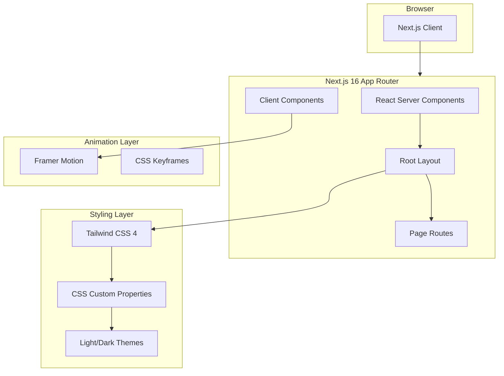
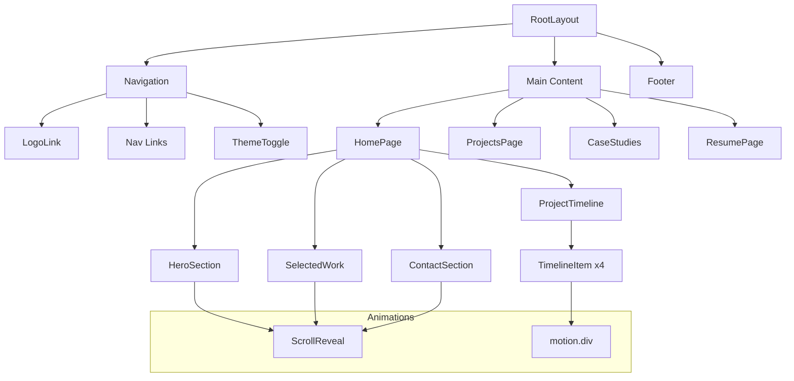
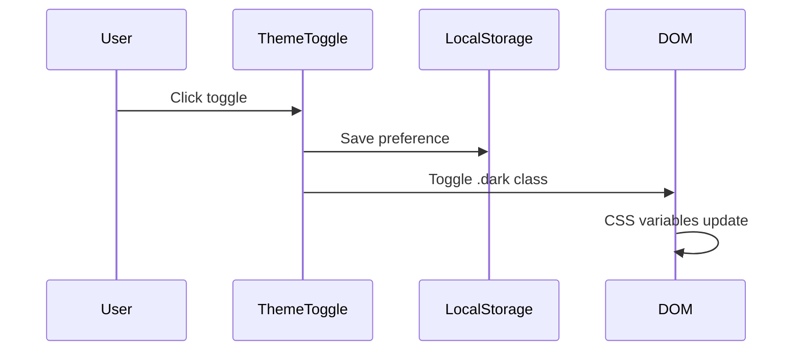

# System Architecture

Detailed technical documentation of the Portfolio website's architecture, design patterns, and component structure.

---

## High-Level Architecture



---

## Component Hierarchy



---

## Design System

### CSS Custom Properties

The design system uses CSS custom properties for theming:

```css
/* Light Mode (Default) */
:root {
  --background: #ffffff;
  --foreground: #171717;
  --muted: #737373;
  --accent: #1C64F2;
  --accent-hover: #1a56db;
  --success: #22c55e;
  --border: #e5e5e5;
  --card: #ffffff;
}

/* Dark Mode */
:root.dark {
  --background: #0a0a0a;
  --foreground: #e5e5e5;
  --muted: #a3a3a3;
  --accent: #1C64F2;
  --accent-hover: #3b82f6;
  --success: #22c55e;
  --border: #262626;
  --card: #171717;
}
```

### Tailwind Integration

CSS variables are mapped to Tailwind classes via `@theme inline`:

| CSS Variable | Tailwind Class | Usage |
|--------------|----------------|-------|
| `--background` | `bg-background` | Page backgrounds |
| `--foreground` | `text-foreground` | Primary text |
| `--muted` | `text-muted` | Secondary text |
| `--accent` | `bg-accent`, `text-accent` | CTAs, links |
| `--border` | `border-border` | Dividers, cards |
| `--card` | `bg-card` | Card backgrounds |

---

## Theme Toggle Implementation



### Flash Prevention

Theme is applied before React hydration via inline script in `<head>`:

```javascript
(function() {
  var theme = localStorage.getItem('theme');
  if (theme === 'dark') {
    document.documentElement.classList.add('dark');
  }
})();
```

---

## Animation Architecture

### Framer Motion Components

| Component | Animation Type | Trigger |
|-----------|---------------|---------|
| `ScrollReveal` | Fade + slide up | `whileInView` |
| `ProjectTimeline` | Scroll progress | `useScroll` |
| `TimelineItem` | Fade + slide | `whileInView` |

### CSS Animations

```css
@keyframes fadeIn {
  from { opacity: 0; transform: translateY(8px); }
  to { opacity: 1; transform: translateY(0); }
}

.animate-fade-in { animation: fadeIn 0.5s ease-out forwards; }
.animate-fade-in-delay { animation: fadeIn 0.5s ease-out 0.15s forwards; }
```

---

## Routing Structure

```
/                     → Home (Hero + Timeline + Contact)
/projects             → Projects List
/projects/relearnable → Relearnable Case Study
/projects/tratlus     → Tratlus Case Study
/projects/flavorbot   → FlavorBot Case Study
/projects/kairo       → Kairo Case Study
/resume               → Resume Page
```

---

## Performance Optimizations

| Optimization | Implementation |
|--------------|----------------|
| **Image Optimization** | Next.js `Image` component with `priority` |
| **Font Loading** | `next/font` with `display: swap` |
| **CSS** | Tailwind tree-shaking, `@theme inline` |
| **Animations** | `viewport: { once: true }` for scroll triggers |
| **Bundle** | Next.js automatic code splitting |
