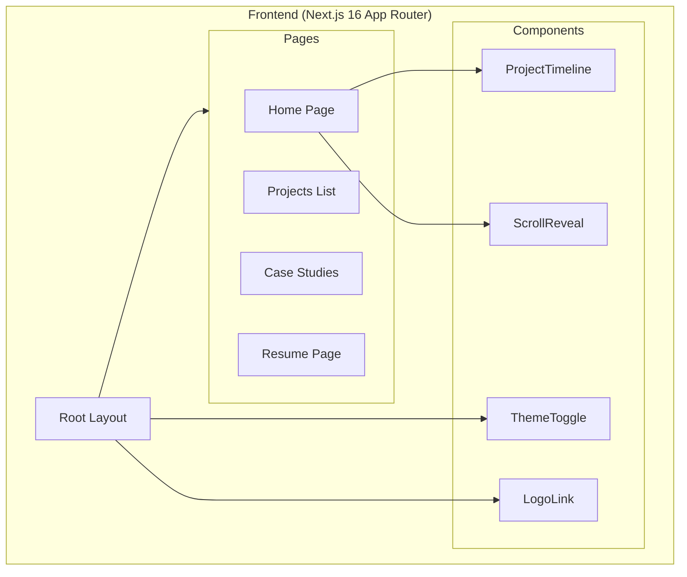

<div align="center">

# Sahil Kamal — Portfolio

### Personal Portfolio Website

🚀 **Live Production Site** — *Showcasing production software, engineering projects, and technical expertise*

[](https://nextjs.org/)
[](https://react.dev/)
[](https://www.typescriptlang.org/)
[](https://tailwindcss.com/)
[](https://www.framer.com/motion/)
[](LICENSE)

---

**[🌐 Live Site](https://sahilkamal.dev)** · **[💼 LinkedIn](https://linkedin.com/in/sahilkamalny)** · **[🐙 GitHub](https://github.com/sahilkamalny)** · **[📧 Contact](mailto:sahilkamal.dev@gmail.com)**

</div>

---

## 📸 Screenshots

<div align="center">

| Hero Section | Project Timeline |
|:---:|:---:|
|  |  |

| Dark Mode | Projects Page |
|:---:|:---:|
|  |  |

</div>

---

## ✨ Features

### 🎨 Modern Design System
- **CSS Custom Properties**: Centralized design tokens for colors, spacing, and typography
- **Light/Dark Mode**: Smooth theme toggle with localStorage persistence
- **Responsive Layout**: Mobile-first design that scales beautifully to desktop

### 📜 Scroll-Animated Timeline
- Interactive project timeline with scroll-triggered animations
- Alternating left/right layout on desktop, linear on mobile
- Animated progress line that fills as you scroll
- Project cards with metrics, tech stack, and action buttons

### ✨ Smooth Animations
- **Framer Motion Integration**: Page transitions, hover effects, and scroll reveals
- **ScrollReveal Component**: Reusable scroll-triggered fade-in animations
- **CSS Keyframe Animations**: Performance-optimized fade-in effects

### 📄 Case Study Pages
- Dedicated pages for each featured project
- Technical deep-dives with architecture explanations
- Live demo links and GitHub repository links

### 🎯 Recruiter-Optimized
- Clear professional summary with quantifiable achievements
- Prominent contact CTAs (Email, LinkedIn, GitHub)
- Downloadable resume integration
- SEO-optimized metadata

---

## 🏗️ Architecture Overview



### Key Architectural Decisions

| Component | Choice | Rationale |
|-----------|--------|-----------|
| **Framework** | Next.js 16 | App Router, RSC support, optimized builds |
| **UI Library** | React 19 | Latest features, improved performance |
| **Language** | TypeScript 5 | Type safety, better DX, self-documenting |
| **Styling** | Tailwind CSS 4 | Utility-first, CSS variables integration |
| **Animations** | Framer Motion 12 | Declarative animations, scroll triggers |
| **Fonts** | Custom + Google | Corporate S Pro + Geist Mono |

---

## 📁 Project Structure

```
portfolio/
├── src/
│   ├── app/                    # Next.js App Router
│   │   ├── layout.tsx          # Root layout with nav + footer
│   │   ├── page.tsx            # Home page
│   │   ├── globals.css         # CSS custom properties + themes
│   │   ├── projects/           # Projects routes
│   │   │   ├── page.tsx        # Projects list
│   │   │   ├── relearnable/    # Case study
│   │   │   ├── tratlus/        # Case study
│   │   │   ├── flavorbot/      # Case study
│   │   │   └── kairo/          # Case study
│   │   └── resume/             # Resume page
│   ├── components/
│   │   ├── ProjectTimeline.tsx # Scroll-animated timeline
│   │   ├── ThemeToggle.tsx     # Dark/light mode toggle
│   │   ├── LogoLink.tsx        # Animated home link
│   │   └── ui/
│   │       └── ScrollReveal.tsx # Scroll animation wrapper
│   └── fonts/                  # Custom fonts
├── public/
│   ├── profile.png             # Profile image
│   └── resume.pdf              # Downloadable resume
├── tailwind.config.ts          # Tailwind configuration
├── next.config.ts              # Next.js configuration
└── package.json                # Dependencies
```

---

## 🚀 Quick Start

### Prerequisites
- Node.js 18+
- npm, yarn, or pnpm

### Installation

```bash
# Clone the repository
git clone https://github.com/sahilkamalny/portfolio.git
cd portfolio

# Install dependencies
npm install

# Start development server
npm run dev
```

Open [http://localhost:3000](http://localhost:3000) to view the site.

### Build for Production

```bash
npm run build
npm start
```

---

## 🛠️ Tech Stack

| Layer | Technologies |
|-------|-------------|
| **Framework** | Next.js 16 (App Router) |
| **UI** | React 19, TypeScript 5 |
| **Styling** | Tailwind CSS 4, CSS Custom Properties |
| **Animation** | Framer Motion 12 |
| **Utilities** | clsx, tailwind-merge |
| **Fonts** | Corporate S Pro, Geist Mono |
| **Deployment** | Vercel |

---

## 📊 Featured Projects

| Project | Type | Highlights |
|---------|------|------------|
| **[Relearnable](https://relearnable.ai)** | AI SaaS | 80+ users, Knowledge Correction Engine |
| **[Tratlus](https://tratlus.vercel.app)** | AI Travel | Google APIs, Stripe integration |
| **FlavorBot** | Desktop App | 🏆 RamHacks 2025 Winner |
| **Kairo** | OS Shell | 100+ chainable commands |

---

## 📬 Contact

**Sahil Kamal** — Software Engineer

- 🌐 Portfolio: [sahilkamal.dev](https://sahilkamal.dev)
- 💼 LinkedIn: [linkedin.com/in/sahilkamalny](https://linkedin.com/in/sahilkamalny)
- 🐙 GitHub: [github.com/sahilkamalny](https://github.com/sahilkamalny)
- 📧 Email: [sahilkamal.dev@gmail.com](mailto:sahilkamal.dev@gmail.com)

---

<div align="center">

### 📝 License

This project is open source under the [MIT License](LICENSE).

**© 2025 Sahil Kamal**

</div>
