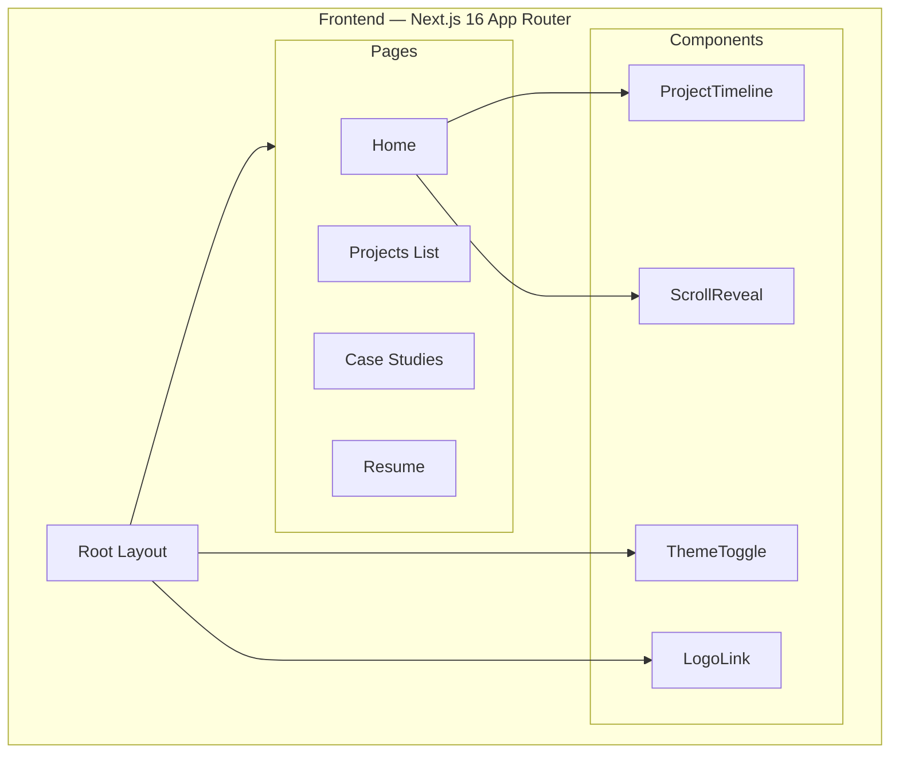

<div align="center">

# sahilkamal.dev

**Personal portfolio and case study site — scroll-animated project timeline, dark/light mode, and dedicated technical deep-dives for each project.**

[](https://nextjs.org/)
[](https://react.dev/)
[](https://www.typescriptlang.org/)
[](https://tailwindcss.com/)
[](https://www.framer.com/motion/)

**Built with** Next.js · React 19 · TypeScript · Tailwind CSS · Framer Motion · Vercel

[Live Site](https://sahilkamal.dev) · [LinkedIn](https://linkedin.com/in/sahilkamalny) · [GitHub](https://github.com/sahilkamalny) · [Contact](mailto:sahilkamal.dev@gmail.com)

</div>

---

## Screenshots

<div align="center">

| Hero Section | Project Timeline |
|:---:|:---:|
|  |  |

| Dark Mode | Projects Page |
|:---:|:---:|
|  |  |

</div>

---

## Overview

A Next.js 16 App Router site built to present engineering work to recruiters and engineers. The centerpiece is a scroll-animated project timeline with an animated progress line, alternating card layout, and per-project metrics. Each featured project links to a dedicated case study page with architecture explanations, technical decisions, and live demo / repo links. Dark and light mode are supported with system preference detection and localStorage persistence.

---

## Features

**Scroll-Animated Timeline** — Scroll-triggered progress line that fills as the user moves down the page. Alternating left/right card layout on desktop, linear stack on mobile. Each card surfaces project metrics, tech stack, and action links.

**Case Study Pages** — Dedicated routes for each featured project with technical deep-dives, architecture breakdowns, and live demo links.

**Smooth Animations** — Framer Motion page transitions, hover effects, and scroll reveals via a reusable `ScrollReveal` wrapper component. CSS keyframe animations for performance-critical fade-ins.

**Design System** — CSS custom properties for centralized color, spacing, and typography tokens. Light/dark themes toggle cleanly without flash.

**Recruiter-Optimized** — Professional summary with quantifiable achievements, prominent contact CTAs, downloadable resume, and SEO-optimized metadata.

---

## Architecture


```mermaid
flowchart TB
    subgraph Client["Frontend — Next.js 16 App Router"]
        Layout[Root Layout]
        Pages[Pages]
        Components[Components]
    end

    subgraph Pages
        Home[Home]
        Projects[Projects List]
        CaseStudy[Case Studies]
        Resume[Resume]
    end

    subgraph Components
        Timeline[ProjectTimeline]
        ThemeToggle[ThemeToggle]
        ScrollReveal[ScrollReveal]
        LogoLink[LogoLink]
    end

    Layout --> Pages
    Home --> Timeline & ScrollReveal
    Layout --> ThemeToggle & LogoLink
```

**Key decisions**

| Concern | Choice | Rationale |
|---|---|---|
| Framework | Next.js 16 | App Router, RSC support, optimized builds |
| UI | React 19 | Latest concurrent features, improved performance |
| Language | TypeScript 5 | Type safety, self-documenting component APIs |
| Styling | Tailwind CSS 4 | Utility-first with CSS variables integration |
| Animation | Framer Motion 12 | Declarative scroll triggers, layout animations |
| Fonts | Corporate S Pro + Geist Mono | Distinct typographic identity |
| Deployment | Vercel | Zero-config Next.js hosting, edge network |

---

## Project Structure

```
portfolio/
├── src/
│   ├── app/                        # Next.js App Router
│   │   ├── layout.tsx               # Root layout — nav and footer
│   │   ├── page.tsx                 # Home page
│   │   ├── globals.css              # CSS custom properties and themes
│   │   ├── projects/
│   │   │   ├── page.tsx             # Projects list
│   │   │   ├── relearnable/         # Case study
│   │   │   ├── tratlus/             # Case study
│   │   │   ├── flavorbot/           # Case study
│   │   │   └── kairo/               # Case study
│   │   └── resume/                  # Resume page
│   ├── components/
│   │   ├── ProjectTimeline.tsx      # Scroll-animated timeline
│   │   ├── ThemeToggle.tsx          # Dark / light mode toggle
│   │   ├── LogoLink.tsx             # Animated home link
│   │   └── ui/
│   │       └── ScrollReveal.tsx     # Scroll animation wrapper
│   └── fonts/                       # Custom font files
├── public/
│   ├── profile.jpg
│   └── resume.pdf
├── tailwind.config.ts
├── next.config.ts
└── package.json
```

---

## Getting Started

**Prerequisites:** Node.js 18+, npm / yarn / pnpm

```bash
# Clone and install
git clone https://github.com/sahilkamalny/portfolio.git
cd portfolio
npm install

# Start development server
npm run dev
```

Open [http://localhost:3000](http://localhost:3000) to view the site.

```bash
# Production build
npm run build
npm start
```

---

## Featured Projects

| Project | Type | Highlights |
|---|---|---|
| [Relearnable](https://relearnable.ai) | AI SaaS | 100+ users, Knowledge Correction Engine |
| [ActuallyFeed](https://actuallyfeed.com) | Donation Platform | 4× donation volume, Stripe webhooks |
| [Tratlus](https://tratlus.vercel.app) | AI Travel Planner | <30s itineraries, 67% fewer scheduling overlaps |
| FlavorBot | Desktop App | 🏆 RamHacks 2025 Winner |
| KAIRO | OS Shell | 50+ chainable commands |

---

## Tech Stack

| Layer | Technologies |
|---|---|
| Framework | Next.js 16 (App Router) |
| UI | React 19, TypeScript 5 |
| Styling | Tailwind CSS 4, CSS custom properties |
| Animation | Framer Motion 12 |
| Utilities | clsx, tailwind-merge |
| Fonts | Corporate S Pro, Geist Mono |
| Deployment | Vercel |

---

## License

MIT — see [LICENSE](LICENSE) for details.

---

## Contact

**Sahil Kamal** — Software Engineer

[sahilkamal.dev](https://sahilkamal.dev) · [linkedin.com/in/sahilkamalny](https://linkedin.com/in/sahilkamalny) · [github.com/sahilkamalny](https://github.com/sahilkamalny) · [sahilkamal.dev@gmail.com](mailto:sahilkamal.dev@gmail.com)

---

<div align="center">

*© 2026 Sahil Kamal*

</div>
